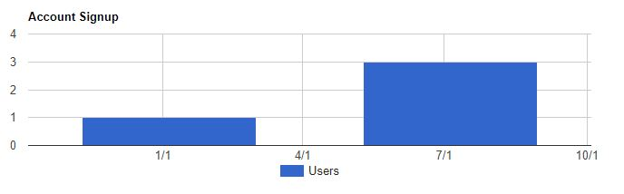

# GoogleChartPHP

First, you should read the [Google Chart Guide](https://developers.google.com/chart/interactive/docs/php_example) to learn how to consume JSON data in JavaScript

Example PHP producing GoogleChart table data (JSON)
	$chart = new GoogleChart();
	
	// Set Column data
	$dateColumn = new GoogleChartColumn();
	$usersColumn= new GoogleChartColumn();
	$dateColumn->setLabel("Date");
	$dateColumn->setType("date");
	$usersColumn->setLabel("Users");
	$usersColumn->setType("number");
	
	// Add columns to chart
	$chart->addColumn($dateColumn);
	$chart->addColumn($usersColumn);
	
	// Set row data
	$row1 = new GoogleChartRow();
	$date1 = new GoogleChartDate();
	$date1->setDateString("2017-01-05");
	$row1->addValue($date1);
	$row1->addValue(1);
	$row2 = new GoogleChartRow();
	$date2 = new GoogleChartDate();
	$date2->setDateString("2017-07-05");
	$row2->addValue($date2);
	$row2->addValue(3);
	
	// Add rows to chart
	$chart->addRow($row1);
	$chart->addRow($row2);
	
	// Encode GoogleChart to JSON and echo the result
	echo json_encode ( $chart );
  
Example of ColumnChart created JavaScript using data sent from PHP

